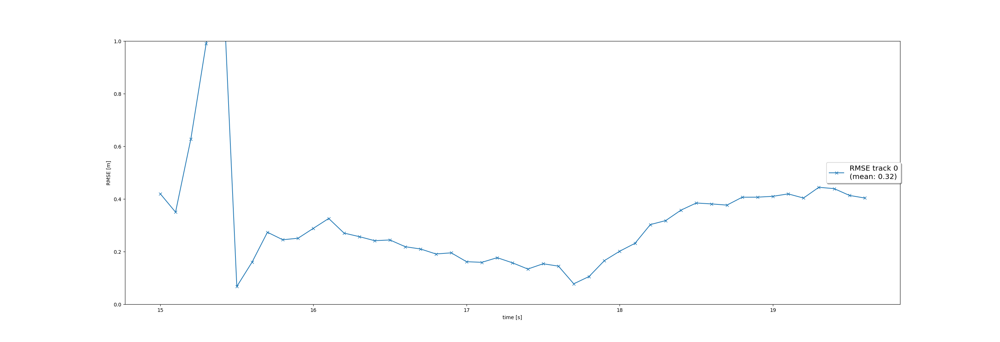
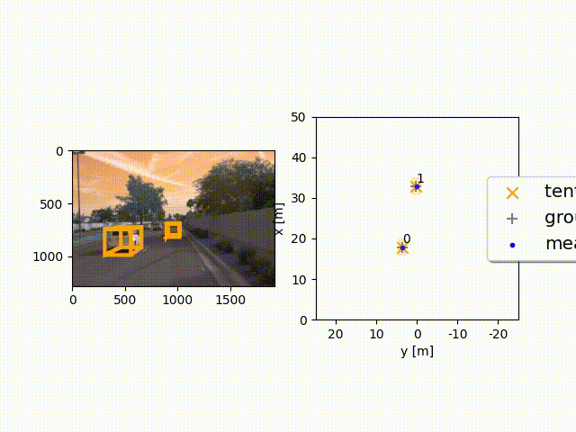

# Final Project

The following steps are completed for this project:
 - Track objects over time with a Kalman Filter
 - Initialize, update and delete tracks
 - Associate measurements to tracks with nearest neighbor association
 - SWBAT fuse measurements from lidar and camera

## Step 1: Track objects over time with a Kalman Filter

## Step 2: Initialize, update and delete tracks

## Step 3: Associate measurements to tracks with nearest neighbor association

## Step 4: SWBAT fuse measurements from lidar and camera

### Output Video:

### 1. Write a short recap of the four tracking steps and what you implemented there (filter, track management, association, camera fusion). Which results did you achieve? Which part of the project was most difficult for you to complete, and why?

 - The overall tracking performance is shown in Step 4, where two of the tracks are tracked from the beginning to the end of the sequence without track loss. The mean RMSE for these two tracks, tracks 0 and 1, is 0.17 and 0.11, respectively.
 - The first three steps are easy to complete. The first step just extends the 2D EKF to the 3D case. The second part implements some track management with some logic. The third part is also learned from the course with sample codes. The most difficult part should be step 4, since you need to understand the coordinate transformation and the nonlinearity of the camera measurement function.

### 2. Do you see any benefits in camera-lidar fusion compared to lidar-only tracking (in theory and in your concrete results)? 

 - Higher precision: In step 4, fusion results show more accurate object detection, lower false positives, and better object classification.
 - Reduced latency: The fusion of camera and LiDAR data can improve object tracking by making predictions more stable and less prone to fluctuations.
 - Enhanced robustness: Systems that use both camera and LiDAR perform better in varying environmental conditions compared to LiDAR-only systems, which can aslo hellp reducing ghost tracks.

### 3. Which challenges will a sensor fusion system face in real-life scenarios? Did you see any of these challenges in the project?
- Calibration and data association were particularly tricky in crowded environments, causing occasional errors in object tracking.
- Environmental conditions like rain and fog severely impacted sensor performance, leading to data degradation in both the LiDAR and camera.
- Computational load and real-time processing were bottlenecks, requiring optimization to meet real-time constraints.
- Cost and scalability were also significant concerns when looking to deploy the fusion system across multiple platforms.

### 4. Can you think of ways to improve your tracking results in the future?
 - Advanced calibration and data association techniques can reduce errors due to misalignment.
 - Using deep learning for robust data association and scene context can improve classification and tracking in complex environments.
 - Multi-frame fusion, adaptive resolution, and predictive models can enhance tracking stability.
 - Incorporating additional sensors (e.g., radar, IMU) and leveraging scene context from HD maps or semantic segmentation can enhance system robustness.
 - Real-time adaptive fusion and edge computing can address computational constraints, ensuring smooth operation in real-world applications.
 - Advanced data association techniques like JPDA, MHT, and the Hungarian algorithm can better handle ambiguous or cluttered scenes by improving the matching between sensor data and tracked objects.
 - Nonlinear motion models like CTRV, CTRA, EKF/UKF, and interaction-aware models can more accurately capture complex, real-world object movements, especially in dynamic and crowded environments.