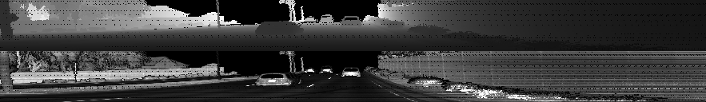
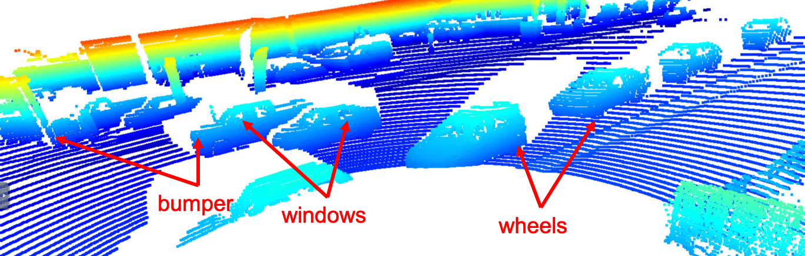
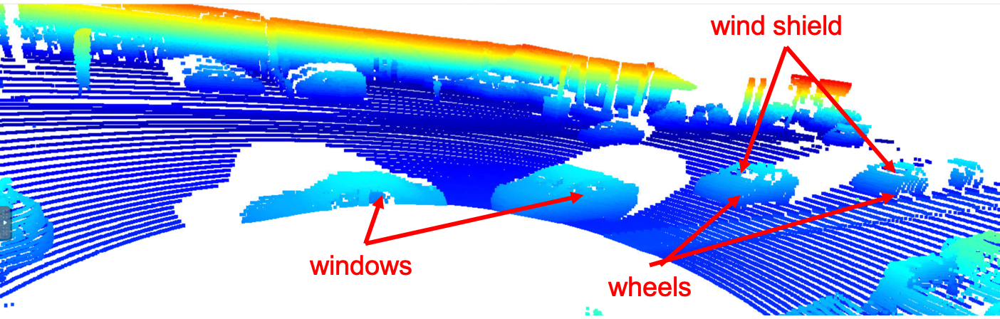
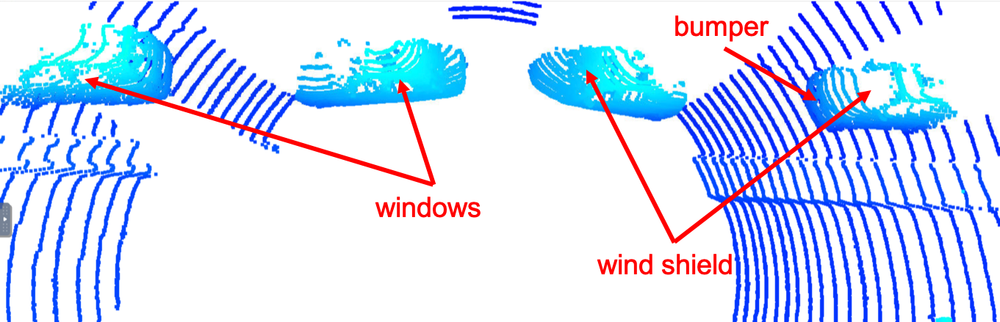

# Mid-Term Project

The following steps are completed for this project:
 - Compute Lidar Point-Cloud from Range Image
 - Create Birds-Eye View from Lidar PCL
 - Model-based Object Detection in BEV Image
 - Performance Evaluation for Object Detection

## Compute Lidar Point-Cloud from Range Image

### Visualize range image channels (ID_S1_EX1)

The range image is cropped to +/- 90 deg and visualized as follow:

### Visualize point-cloud (ID_S1_EX2)

The following vehicle features are identified from different degrees if visibility in the point-cloud.

 - windows
 - bumper
 - wheels
 - wind shield

